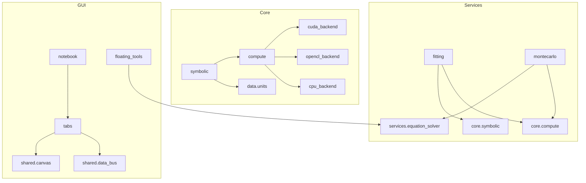
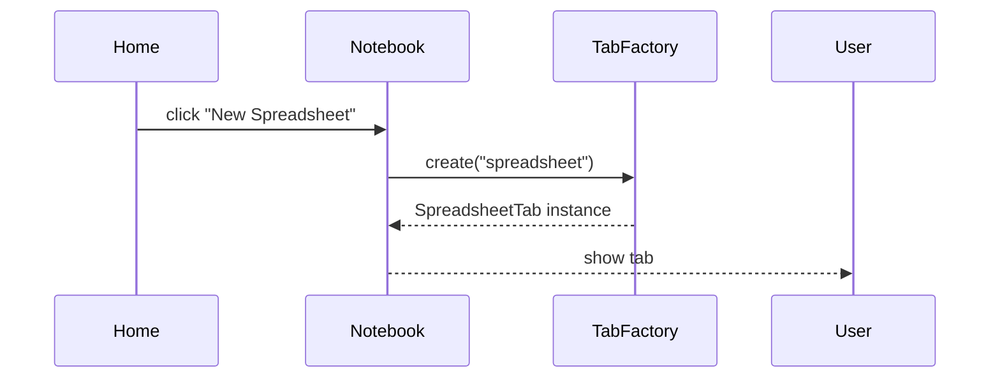
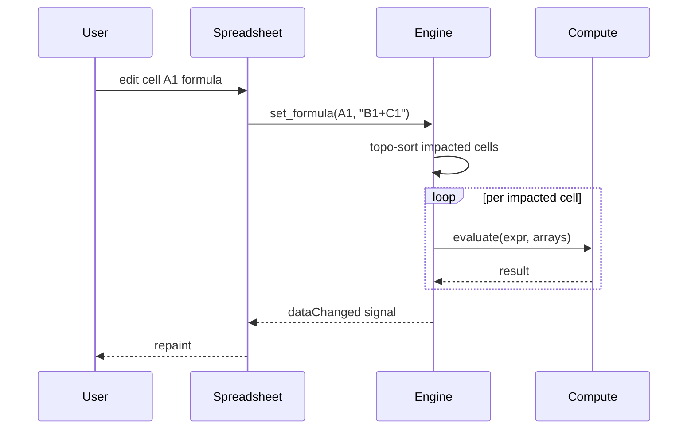
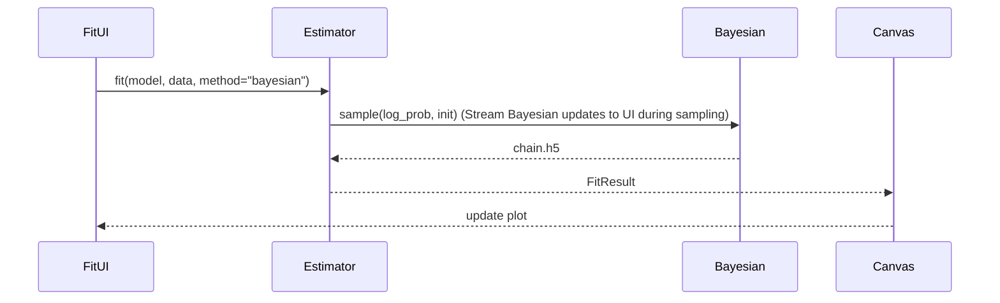
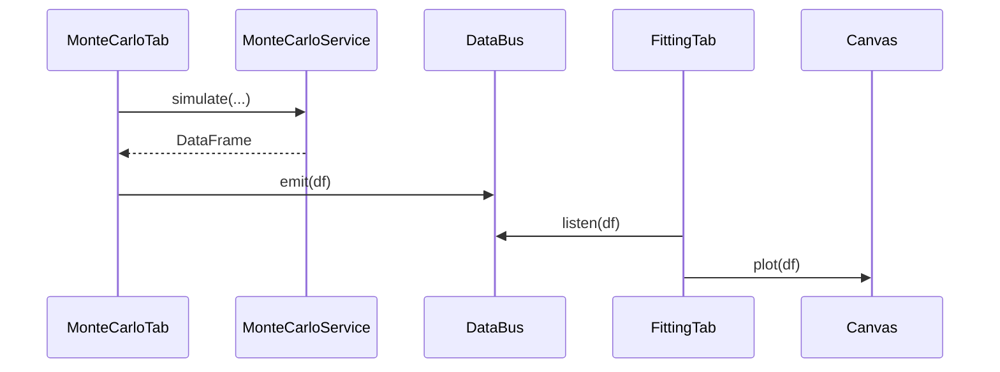

# ANAFIS – Plan
(Notebook Shell, Multi-Tab, Fitting, Uncertainty Calculation, Wolfram Like Solver, Monte-Carlo Simulations)
Date: 2025-08-15

---

## 0. Executive Summary
A **detachable-notebook** desktop app where every major capability—Spreadsheet, Curve-Fitting, Wolfram Like Solver, Monte-Carlo Simulator—**is its own closable tab** spawned from a **Home Menu**.
The Uncertainty calculator will be a small dropdown window.
Each tab is reusable, GPU-accelerated where useful, and communicates over a light **shared data-bus**.

---

## 1. Exact Repository Layout (tree -L 3)

```
anafis/
├── anafis/
│   ├── __init__.py
│   ├── core/
│   │   ├── __init__.py
│   │   ├── symbolic/
│   │   │   ├── __init__.py
│   │   │   ├── engine.py          # topo-sort formula engine
│   │   │   ├── uncertainty.py     # error propagation (sympy+pint)
│   │   │   └── compiler.py        # expr→numba/cuda/opencl
│   │   ├── compute/
│   │   │   ├── __init__.py
│   │   │   ├── hybrid.py          # CPU/GPU/JIT dispatcher
│   │   │   ├── cuda_backend.py
│   │   │   ├── opencl_backend.py
│   │   │   └── cpu_backend.py     # numba+OpenMP fallback
│   │   ├── data/
│   │   │   ├── __init__.py
│   │   │   ├── units.py           # °C vs delta_°C with pint
│   │   │   └── array_ops.py       # chunked & GPU arrays
│   │   └── formula/
│   │       ├── __init__.py
│   │       ├── parser.py          # asteval parser
│   │       └── evaluator.py       # safe eval
│   ├── services/
│   │   ├── __init__.py
│   │   ├── curve_fitting/
│   │   │   ├── __init__.py
│   │   │   ├── estimator.py       # ODR / Bayesian / MCMC
│   │   │   ├── bayesian.py        # mem-mapped emcee
│   │   │   └── visualizer.py      # overlay on canvas
│   │   ├── data_processing.py
│   │   ├── uncertainty.py         # Monte-Carlo service
│   │   ├── equation_solver.py     # step-by-step sympy solver
│   │   └── monte_carlo.py         # synthetic data generator
│   ├── gui/
│   │   ├── __init__.py
│   │   ├── shell/
│   │   │   ├── notebook.py        # tab manager
│   │   │   ├── detachable_tab.py  # tear-off windows
│   │   │   └── home_menu.py       # welcome / new-tab launcher
│   │   ├── tabs/
│   │   │   ├── __init__.py
│   │   │   ├── spreadsheet_tab.py # closable
│   │   │   ├── fitting_tab.py     # closable
│   │   │   ├── solver_tab.py      # closable Wolfram-style
│   │   │   ├── montecarlo_tab.py  # closable
│   │   │   └── shared/
│   │   │       ├── canvas.py      # 5-D vispy canvas
│   │   │       └── data_bus.py    # inter-tab data exchange
│   │   └── utils/
│   │       ├── uncertainty_dialog.py   # F9 pop-up
│   │       ├── quick_solver.py         # Alt+S mini solver
│   │       └── latex_editor.py         # live LaTeX widget
│   ├── persistence/
│   │   ├── state_manager.py       # .anafis HDF5 save/restore
│   │   └── update_checker.py
│   ├── utils/
│   │   ├── config.py
│   │   ├── logger.py
│   │   └── async_worker.py
├── tests/
├── scripts/
├── requirements.txt
├── environment.yml
└── ANAFIS_MasterPlan_FINAL.md
```

---

## 2. Library Map – “What ships where”

| Module | Primary Lib | Fallback | Why |
|---|---|---|---|
| **shell/notebook.py** | PyQt6 | | detachable tabs |
| **tabs/solver_tab.py** | sympy, latex2sympy2, matplotlib | pylatexenc | live LaTeX + step engine |
| **gui/plotting/** | `vispy` (OpenGL) | `matplotlib` |  |
| **tabs/montecarlo_tab.py** | numpy, pandas, numba | pure loops | synthetic data |
| **core/data/** | `pint` | `unyt` | °C vs delta_°C handled |
| **services/curve_fitting/** | `lmfit`, `emcee` | `scipy.optimize` | mem-mapped chains |
| **core/symbolic/** | `sympy`, `networkx` | `rustworkx` | DAG for O(n) updates |
| **compute/** | pycuda, pyopencl, numba | numpy | auto-dispatch |
| **data/units.py** | pint | unyt | °C vs K |
| **services/bayesian.py** | emcee + h5py | memory | mem-mapped chains |
| **persistence/state_manager.py** | h5py | | save open tabs |
| **utils/** | `toml`, `loguru` | stdlib `logging` | friendly logging |
---

## 3. Per-File Implementation Details

| File | Purpose | Key Classes / Functions |
|---|---|---|
| `shell/notebook.py` | Root window, tab factory, close/detach logic | `AnafisNotebook`, `new_tab()`, `close_tab()`, `detach_tab()` |
| `shell/home_menu.py` | Welcome screen + “New X” buttons | `HomeMenuWidget`, `on_new_spreadsheet()` etc. |
| `tabs/spreadsheet_tab.py` | Spreadsheet grid inside closable tab | `SpreadsheetTab` → embed `SpreadsheetWidget` |
| `tabs/fitting_tab.py` | Curve fitting UI + plot | `FittingTab` → embed `FittingWidget` + `Canvas` |
| `tabs/solver_tab.py` | Wolfram-α solver w/ steps | `SolverTab` → embed `LatexEditor`, `StepView`, `MiniPlot` |
| `tabs/montecarlo_tab.py` | Monte-Carlo generator | `MonteCarloTab` → `ParameterTable`, `RunButton`, `Histogram`, `SendToFitting` |
| `tabs/shared/data_bus.py` | Signal bus between tabs | `DataBus(QtCore.pyqtSignal)` emits `DataFrame` |
| `services/equation_solver.py` | step-by-step solver backend | `solve_step_by_step(expr)` returns list of `(step_latex, step_text)` |
| `services/monte_carlo.py` | generate synthetic data | `simulate(model_str, params_df, n_samples)` returns `DataFrame` |
| `utils/latex_editor.py` | live LaTeX input | `LatexEditor(QTextEdit)` + palette buttons |
| `utils/uncertainty_dialog.py` | floating uncertainty tool | `UncertaintyDialog` (non-modal) |
| `utils/quick_solver.py` | floating mini solver | `QuickSolver` single-line input |

---

## 4. GUI Sketches & Pop-ups

### 4.1 Home Menu (index 0, cannot close)
```
┌──────────────────── Home ────────────────────┐
│ ┌─Recent Files────────┐ ┌─Quick New────────┐ │
│ │ • pendulum.csv      │ │ □ Spreadsheet    │ │
│ │ • g_measurement.h5  │ │ □ Fitting        │ │
│ └─────────────────────┘ │ □ Solver         │ │
│                         │ □ Monte-Carlo    │ │
│                         └──────────────────┘ │
│                                              │
└──────────────────────────────────────────────┘
```

### 4.2 Fitting GUI
┌─────────────────────────────────────────────────────────────────────────────────────────────── Fitting Tab ──────────────────────────────────────────────────────────────────────────────────────────────┐
│ ┌─────────────────────────────────────────────── Toolbar ──────────────────────────────────────────────────────────────────────────────────────────────────────────────────────────────────────────────┐ │
│ [Open Dataset ▼] [Save Fit] [Undo ↶] [Redo ↷] [Export PDF] [Settings ⚙]                                                                                                                               │ │
│ └──────────────────────────────────────────────────────────────────────────────────────────────────────────────────────────────────────────────────────────────────────────────────────────────────────┘ │
│                                                                                                                                                                                                          │
│ ┌──────────────────────── Left Panel ────────────────────────┐  ┌──────────────────────────────────────────────────────── Central Canvas (VisPy 5-D) ──────────────────────────────────────────────────┐ │
│ │  DATA SOURCE                                               │  │                                                                                                                                      │ │
│ │  ┌───────────────────────────────────────────────────────┐ │  │                                                                                                                                      │ │
│ │  │ Source:                                               │ │  │                    (3-D view with color & size)                                                                                      │ |
│ │  │ • Spreadsheet tab 1                                   │ │  │                                                                                                                                      │ │
│ │  │ • File: pendulum.csv                                  │ │  │           ●   ●   ●   ●   ●   ●   ●   ●   ●   ●                                                                                      │ |
│ │  │ • URL / API                                           │ │  │                                                                                                                                      │ │
│ │  └───────────────────────────────────────────────────────┘ │  │                                                                                                                                      │ │
│ │  COLUMN MAPPING                                            │  │                                                                                                                                      │
│ │  ┌───────────────────────────────────────────────────────┐ │  │                                                                                                                                      │
│ │  │ var1  →  Column A   [units: s]   → x axis             │ │  │                                                                                                                                      │
│ │  │ var2  →  Column B   [units: m]   → y axis             │ │  │                                                                                                                                      │
│ │  │ [  ]  →  Column C   [units: kg]  → z axis             │ │  │                                                                                                                                      │
│ │  │ [  ]  →  Column D   [units: %]   → color axis         │ │  │                                                                                                                                      │
│ │  │ [  ]  →  Column E   [units: kg]   → slider            │ │  │                                                                                                                                      │
│ │  └───────────────────────────────────────────────────────┘ │  │                                                                                                                                      │
│ │  MODEL                                                     │  │                                                                                                                                      │
│ │  ┌───────────────────────────────────────────────────────┐ │  │                                                                                                                                      │
│ │  │ Formula:                                              │ │  │                                                                                                                                      │
│ │  │ [var2 = par1 * sin(par2 * var1 + par3)]               │ │  │                                                                                                                                      │
│ │  │                                                       │ │  │                                                                                                                                      │
│ │  │ PARAM      Estimation  LOCK   Fit                     │ │  │                                                                                                                                      │
│ │  │ par1       1.0         [ ]    [✓]                     │ │  │                                                                                                                                      │
│ │  │ par2       2.0         [ ]    [✓]                     │ │  │                                                                                                                                      │
│ │  │ par3       0.0         [ ]    [✓]                     │ │  │                                                                                                                                      │
│ │  │ +par                                                  │ │  │                                                                                                                                      │
│ │  └───────────────────────────────────────────────────────┘ │  │                                                                                                                                      │
│ │  FIT METHOD                                                │  │                                                                                                                                      │
│ │  ┌───────────────────────────────────────────────────────┐ │  │                                                                                                                                      │
│ │  │ ○ ODR (Orthogonal Distance Regression)                │ │  │                                                                                                                                      │
│ │  │ ○ Bayesian MCMC (emcee)                               │ │  │                                                                                                                                      │
│ │  │ ○ Levenberg-Marquardt                                 │ │  │                                                                                                                                      │
│ │  └───────────────────────────────────────────────────────┘ │  │                                                                                                                                      │
│ │  OPTIONS                                                   │  │--------------------------------------------------------------------------------------------------------------------------------------│ │
│ │  ┌───────────────────────────────────────────────────────┐ │  │  Residuals - var(dropdown for user to chosse)                                                                                        │ |
│ │  │ □ Use analytical Jacobian                             │ │  │                                                                                                                                      │ │
│ │  │ □ Parallel on GPU (CUDA available)                    │ │  │                                                                                                                                      │ |
│ │  │ Iterations: [  1000  ]                                │ │  │                                                                                                                                      │ |
│ │  └───────────────────────────────────────────────────────┘ │  │                                                                                                                                      │ |
│ │  PROGRESS                                                  │  │                                                                                                                                      │ |
│ │  ┌───────────────────────────────────────────────────────┐ │  │                                                                                                                                      │ |
│ │  │ [████████████████████████████] 75 %  ETA 00:12        │ │  │                                                                                                                                      │ |
│ │  │ Chi² = 1.23  Last iter Δ < 1e-6                       │ │  │                                                                                                                                      │ |
│ │  └───────────────────────────────────────────────────────┘ │  │                                                                                                                                      │ |
│ └────────────────────────────────────────────────────────────┘  └──────────────────────────────────────────────────────────────────────────────────────────────────────────────────────────────────────┘ │
│                                                                                                       -----------------------slider-----------------                                                     │
│ ┌─────────────────────────────────────────────── RESULTS ─────────────────────────┐          (here maybe add a button to open a window to customize the graph                                            │
│ │                                                                                 |           add a way to change colors labels and styles label and plot functions in the graph given a formula)        |
│ |┌─Best-Fit Parameters──────────────────┐ ┌─Covariance Matrix───────────────────┐ |         ┌─Export Options────────────────────────────────────────────────┐                                            │
│ |│ A = 1.02 ± 0.03                      │ │  0.001  0.0002 …                    │ |         │ [Save Fit Params] [Copy LaTeX] [Copy PNG] [Export PDF Report] │                                            │
│ ││ B = 2.01 ± 0.02                      │ │  0.0002 0.0005 …                    │ |         └───────────────────────────────────────────────────────────────┘                                            │
│ ││ C = 0.05 ± 0.15                      │ │ …                                   │ |                                                                                                                      │
│ ││ D = 0.48 ± 0.02                      │ └─────────────────────────────────────┘ |                                                                                                                      │
│ │└──────────────────────────────────────┘                                         |                                                                                                                      |
| |┌─Fit Stats──────────────────┐                                                   |                                                                                                                      |
| ||  X² =                      │                                                   |                                                                                                                      |
| ||  Chi² =                    │                                                   |                                                                                                                      |
| ||  other things              │                                                   |                                                                                                                      |
| |└────────────────────────────┘                                                   |                                                                                                                      │
│ └─────────────────────────────────────────────────────────────────────────────────┘                                                                                                                      |
└──────────────────────────────────────────────────────────────────────────────────────────────────────────────────────────────────────────────────────────────────────────────────────────────────────────┘


### 4.3 Solver Tab (closable)
```
┌──────────────────────── Solver ────────────────────────┐
│ ┌─Live Preview───────────────┐                         │
│ |∫₀¹ x² dx|                  │                         │
│ └────────────────────────────┘                         |
│ ┌─Inputs──────────────┐                                |
│ │ buttons for easy    │                                |
│ │ writing in the      │                                |
│ │ preview             │                                |
│ └─────────────────────┘                                |
│ ┌─Step Guide (expand)──────┐┌─Plot────────────────────┐│
│ │ 1. Apply power rule …    ||  if possible to         ||
│ │                          ||  visualize              ||
│ │                          ||  the solution           ││
│ └──────────────────────────┘└─────────────────────────┘│
│ [Copy LaTeX] [Copy PNG] [Export PDF]                   │
└────────────────────────────────────────────────────────┘
```

### 4.4 Monte-Carlo Tab (closable)
```
┌──────────────────── Monte-Carlo ─────────────────────┐
│ ┌─Model Formula─────────────────────────────────────┐│
│ g = 4 * π**2 * L / T**2                             ││
│ └───────────────────────────────────────────────────┘│
│ ┌─Parameters Table──────────────────────────────────┐│
│ Param│ Value│ ±σ│ Dist│ Samples│                    ││
│ L    │ 1.00 │0.02│ N   │ 1e6    │                   ││
│ T    │ 2.00 │0.05│ N   │ 1e6    │                   ││
│ └───────────────────────────────────────────────────┘│
│ ┌─Visualize Simulation──────────────────────────────┐|
│ │                                                   │|
│ └───────────────────────────────────────────────────┘|
│   ▶ Run Simulation                                  │
│   Progress Bar                                       │
│   [Send to Fitting →]                                │
└──────────────────────────────────────────────────────┘
```

### 4.5 Floating Pop-ups
```
┌──────── Uncertainty Tool ────────┐    ┌──── Quick Solver ─────┐
│ Expression: f(x) = A sin(x)      │    │ Equation: x^2 - 2 = 0 │
│ A = 1 ± 0.1                      │    │ [Solve]               │
│ [Calculate]                      │    └───────────────────────┘
└──────────────────────────────────┘
```

---

## 5. Dependency Chart (mermaid)



---

## 6. Detailed Data-Flows

### 6.1 Home → New Spreadsheet

### 6.2 Spreadsheet Formula Update

Formula Engine: O(n²) dependency resolution
Fix: Use incremental topological updates in symbolic/engine.py

### 6.3 Curve Fitting Pipeline


### 6.4 Monte-Carlo → Fitting


---

## 7. Per-File Code Skeletons (copy-ready)

### 7.1 `shell/notebook.py`
```python
from PyQt6.QtWidgets import QTabWidget, QMainWindow
from .home_menu import HomeMenuWidget
from .tabs import SpreadsheetTab, FittingTab, SolverTab, MonteCarloTab

class AnafisNotebook(QMainWindow):
    def __init__(self):
        super().__init__()
        self.tabs = QTabWidget()
        self.tabs.setTabsClosable(True)
        self.tabs.tabCloseRequested.connect(self.close_tab)
        self.setCentralWidget(self.tabs)
        self.insert_home_tab()
        self.setWindowTitle("ANAFIS – Workbook")

    def insert_home_tab(self):
        self.tabs.insertTab(0, HomeMenuWidget(self), "🏠 Home")
        self.tabs.setTabToolTip(0, "Welcome / Launcher")

    def new_tab(self, tab_type: str):
        mapping = {
            "spreadsheet": SpreadsheetTab,
            "fitting": FittingTab,
            "solver": SolverTab,
            "montecarlo": MonteCarloTab,
        }
        widget = mapping[tab_type](self)
        idx = self.tabs.addTab(widget, f"{tab_type.capitalize()} {self.tabs.count()}")
        self.tabs.setCurrentIndex(idx)

    def close_tab(self, index):
        if index != 0:  # protect Home
            self.tabs.removeTab(index)
```

### 7.2 `tabs/solver_tab.py`
```python
from PyQt6.QtWidgets import QWidget, QVBoxLayout
from ..utils.latex_editor import LatexEditor
from ..services.equation_solver import solve_step_by_step

class SolverTab(QWidget):
    def __init__(self, parent=None):
        super().__init__(parent)
        layout = QVBoxLayout(self)
        self.editor = LatexEditor(self)
        self.step_view = QTextEdit(readOnly=True)
        layout.addWidget(self.editor)
        layout.addWidget(self.step_view)
        self.editor.textChanged.connect(self.solve)

    def solve(self):
        expr = self.editor.toPlainText()
        steps = solve_step_by_step(expr)
        self.step_view.setHtml("<br>".join(steps))
```

---

## 8. Implementation Checklist (Copy into GitHub Issues)

- [ ] **Week 1** – skeleton, conda env, logger
- [ ] **Week 2** – spreadsheet + topo-sort engine
- [ ] **Week 3** – units wrapper + hybrid compute
- [ ] **Week 4** – 2-D plotting + ODR fitting (MVP)
- [ ] **Week 5** – 5-D vispy canvas + dim mapper
- [ ] **Week 6** – GPU backends + mem-mapped MCMC
- [ ] **Week 7** – uncertainty & equation solver UI
- [ ] **Week 8** – packaging, auto-updater, docs

---

## 9. Issue Tracker (GitHub)

| # | Title | Milestone |
|---|---|---|
| #601 | Home Menu widget | Week 1 |
| #602 | Tab factory + closable logic | Week 1 |
| #603 | Detachable windows | Week 2 |
| #604 | Solver live LaTeX + steps | Week 2 |
| #605 | Monte-Carlo → Fitting bridge | Week 3 |
| #606 | Persist open tabs on exit | Week 4 |

---

## 10. Developer Bootstrap (unchanged)

```bash
git clone https://github.com/your-org/anafis.git
cd anafis
conda env create -f environment.yml
conda activate anafis
python -m anafis.app
```

---

## 11. Quick-start for Users (README snippet)

1. Launch ANAFIS → **Home Menu** appears
2. Click **“New Spreadsheet”** (or press `Ctrl+N`)
3. Press `Ctrl+Shift+N` (new dialog), `Ctrl+W` (close tab).
4. Drag tabs out to **detach windows**
5. Press **F9** for floating uncertainty tool anywhere
6. Close any tab except Home – data saved automatically

---
